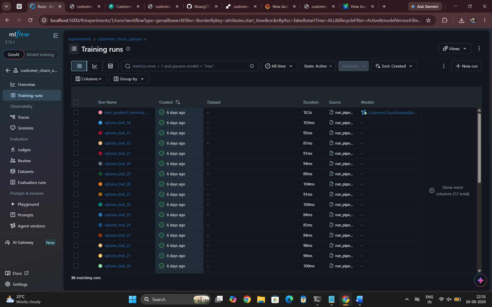
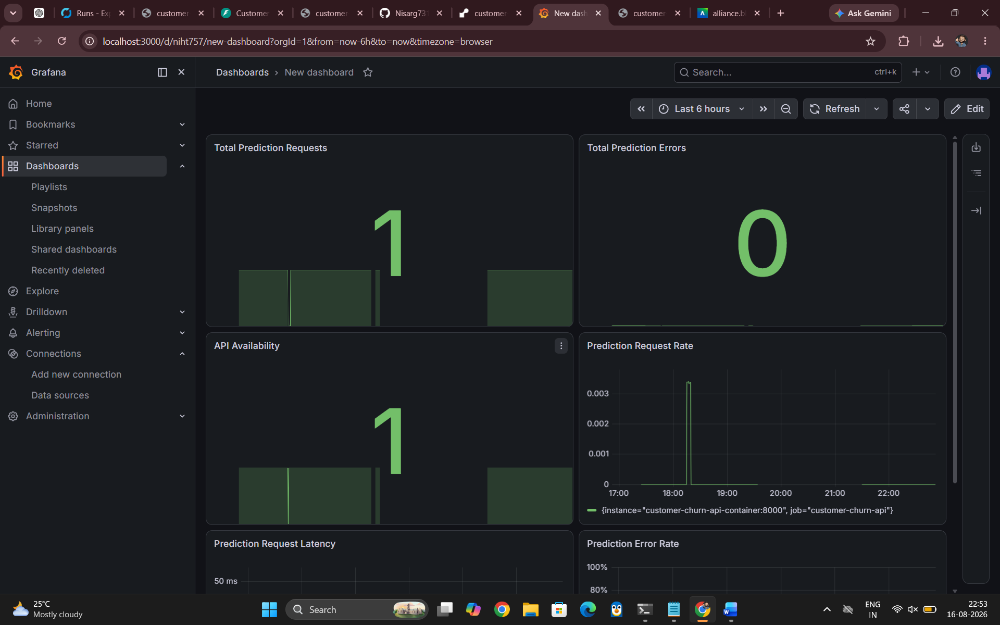
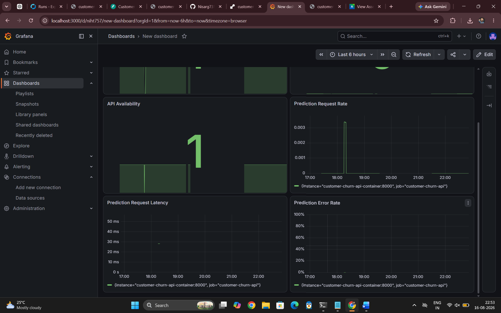

# Customer Churn MLOps — Screenshots

This folder contains screenshots demonstrating the MLflow experiment tracking and Grafana monitoring dashboards used in the Customer Churn MLOps project.

---

## MLflow Experiment Tracking

Optuna hyperparameter tuning runs and the final Gradient Boosting model were tracked using MLflow.

---

## Grafana Monitoring Dashboard

The deployed FastAPI service is monitored using Prometheus and Grafana.

---

## Grafana Monitoring — Additional View

Additional Grafana monitoring view showing application performance and prediction metrics.

